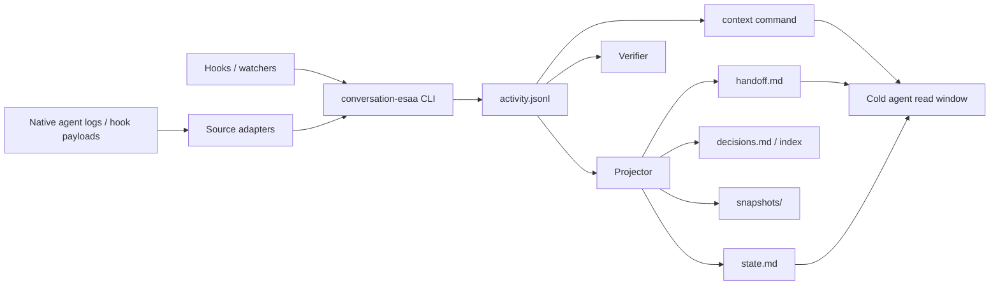

# Conversation ESAA System Design v1/v2

> Status: draft arquitetural revisado por Grok e Codex (2026-06-21). Ferramenta greenfield, sem edicao manual, sem legado. Secao 19 registra parecer formal do Grok. Pronto para implementacao v1.1 apos ADRs curtas. Este documento vem antes de nova escrita do paper.

## 1. Problema

Agentes de codificacao como Codex, Grok e Claude Code mantem conversas em logs privados e heterogeneos. Quando o usuario troca de agente ou a janela de contexto acaba, o proximo agente perde objetivos, decisoes, tarefas abertas e razoes anteriores. Copiar contexto manualmente e caro, incompleto e consome tokens em trabalho mecanico.

O Conversation ESAA resolve isso como um problema de event sourcing: capturar os turnos visiveis, normalizar em um event store compartilhado e projetar read models compactos para handoff.

## 2. Tese de arquitetura

O sistema nao governa "trabalho sobre o projeto" como o ESAA core. Ele governa "memoria conversacional compartilhada entre agentes".

```text
esaa-core
  governa execucao agentica sobre um projeto

conversation-esaa
  governa continuidade, memoria, curadoria e handoff entre agentes
```

Isso implica um vocabulario proprio: `init`, `enable-hooks`, `sync`, `context`, `decide`, `task`, `handoff`, `snapshot`, `redact`, `audit`, `replay`.

## 3. Principios

1. **Captura mecanica automatica.** Hooks/watchers sincronizam conversa sem julgamento de LLM.
2. **Curadoria explicita.** Decisoes e tarefas duraveis sao registradas por agentes, nao inferidas silenciosamente.
3. **Log completo, leitura seletiva.** `activity.jsonl` preserva a trilha fria; agentes leem janelas projetadas.
4. **Projecoes descartaveis.** `state.md`, `handoff.md`, indices e snapshots sao reconstruiveis.
5. **Workspace como fronteira.** Cada projeto tem seu proprio `.conversation-esaa/`; sync nao deve atravessar projetos.
6. **Privacidade por desenho.** Texto verbatim e sensivel; publicar deve usar log vazio ou redigido.
7. **Menos e mais na v1.** Manter v1 simples, local e PowerShell; mover recursos de integridade pesada para v2 se o dominio estabilizar.

## 4. Fronteira do sistema

### Dentro do escopo

- Ingerir turnos visiveis de agentes.
- Deduplicar eventos.
- Projetar `state.md` e `handoff.md`.
- Projetar backlog conversacional em `tasks.json` a partir de eventos `task.*`.
- Validar schema minimo e duplicatas.
- Preparar comandos de contexto paginado.
- Registrar decisoes duraveis.
- Redigir ou excluir dados sensiveis em fluxos futuros.

### Fora do escopo

- Orquestrar execucao de tarefas de engenharia.
- Substituir `.roadmap` ou `esaa-core`.
- Interpretar automaticamente todo historico por LLM.
- Guardar reasoning oculto, tool output bruto, prompts de sistema ou sidechains internas.
- Garantir auditoria forense forte na v1.

## 5. Modelo de dominio

```text
Turno
  evidencia cronologica visivel da conversa

Decisao
  conhecimento duravel curado, com rationale e fontes

Tarefa
  continuidade operacional conversacional

Snapshot
  estado consolidado para horizonte longo

Handoff
  contrato de entrada para agente frio

Context Window
  fatia paginada, deterministica e sob demanda do event store
```

Regra central:

```text
turnos = evidencia
decisoes = conhecimento
tarefas = execucao conversacional
snapshots = compactacao deterministica
handoff = entrada operacional
```

## 6. Arquitetura logica



## 7. Write path

### v1 atual

```text
agent log
  -> conv-sync.ps1 sync-<agent>
  -> normalize conversation_turn
  -> append activity.jsonl
  -> project state.md/handoff.md
  -> verify
  -> save sync-state.json
```

### v1.1 recomendado

Hooks devem chamar um comando unico e mecanico:

```powershell
conversation-esaa sync --agent claude
conversation-esaa sync --agent grok
conversation-esaa sync --agent codex
```

ou, em modo mais event-sourced:

```powershell
conversation-esaa emit --event hook.stop --agent claude
```

O hook nao deve saber como capturar, deduplicar, projetar ou verificar.

Hooks tambem devem ser instalados por comando, nao por edicao manual. O setup esperado e:

```powershell
conversation-esaa enable-hooks --agent grok --workspace C:\xampp\htdocs\meu-projeto --trust
conversation-esaa enable-hooks --agent claude --workspace C:\xampp\htdocs\meu-projeto --trust
conversation-esaa enable-hooks --agent codex --workspace C:\xampp\htdocs\meu-projeto --watcher
```

Esse comando cria/atualiza a configuracao de hooks do workspace e registra o projeto na lista de confianca quando o fornecedor expuser essa superficie por arquivo. Se o harness exigir aprovacao interativa que nao possa ser automatizada com seguranca, o comando deve reportar `approval_required` com a instrucao exata; nao deve marcar a instalacao como concluida silenciosamente.

### Invariante do write path

O cache de dedup nunca e fonte de verdade. Se houver divergencia:

```text
activity.jsonl vence
sync-state.json e reconstruido
projecoes sao regeneradas
```

## 8. Read path

### v1 atual

Agente frio le:

```text
handoff.md
state.md
tasks.json
activity.jsonl, se precisar
```

### v1.1 recomendado

Agente frio le:

```text
handoff.md
state.md
decisions.md
conversation-esaa context --last 30
```

Se faltar contexto:

```powershell
conversation-esaa context --before evt_120 --last 50
conversation-esaa context --around evt_123 --window 10
conversation-esaa context --topic "snapshot"
conversation-esaa context --decision ADR-007
conversation-esaa context --agent grok --last 20
conversation-esaa context --agent claude --last 20
```

Regra:

```text
Agentes nao devem consumir activity.jsonl inteiro por padrao.
Eles devem consumir janelas deterministicas, filtradas e paginadas.
```

`context --agent <agent_id>` e a forma padrao de handoff seletivo entre agentes. Exemplo: o usuario pode pedir ao Codex para ler apenas as ultimas iteracoes do Grok:

```powershell
conversation-esaa context --agent grok --last 20
```

Isso retorna somente eventos do workspace atual associados a `agent_id=grok` ou `source=grok`, mantendo ordem cronologica e metadados suficientes para o Codex continuar sem carregar o historico completo.

## 9. Event model

### Evento mecanico: conversation_turn

```json
{
  "event_id": "sha256-source-session-index-actor-text",
  "ts": "2026-06-21T13:44:18-03:00",
  "event": "conversation_turn",
  "actor": "assistant",
  "agent_id": "codex",
  "source": "codex",
  "source_session_id": "019ee...",
  "source_path": "C:\\Users\\...\\rollout.jsonl",
  "source_index": 42,
  "workspace_root": "C:\\xampp\\htdocs\\meu-projeto",
  "summary": "Deterministic 200 char summary",
  "text": "Visible message text"
}
```

`workspace_root` e obrigatorio em todo evento novo (ADR-008). Eventos legados do lab sem esse campo sao descartados na publicacao greenfield; nao ha migracao.

### Evento curado: decision.recorded

```json
{
  "event_id": "sha256-decision-recorded",
  "ts": "2026-06-21T14:00:00-03:00",
  "event": "decision.recorded",
  "actor": "assistant",
  "agent_id": "codex",
  "decision": "Agentes leem contexto por comandos paginados, nao por activity.jsonl inteiro",
  "rationale": "Preserva horizonte longo sem reintroduzir custo de tokens",
  "related_turns": ["evt_001", "evt_018"]
}
```

### Evento curado: task.updated

```json
{
  "event_id": "sha256-task-updated",
  "ts": "2026-06-21T14:00:00-03:00",
  "event": "task.updated",
  "actor": "assistant",
  "agent_id": "codex",
  "task_id": "CONV-010",
  "status": "open",
  "next_step": "Fechar System Design antes de reescrever o paper"
}
```

## 10. Artefatos

| Artefato | Tipo | Fonte de verdade? | Funcao |
|---|---|---:|---|
| `activity.jsonl` | write model | Sim | Log cronologico completo |
| `tasks.json` | read model | Nao | Backlog conversacional projetado de eventos `task.*` |
| `state.md` | read model | Nao | Estado compacto |
| `handoff.md` | read model | Nao | Contrato de entrada |
| `sync-state.json` | cache | Nao | Dedup/cache de importacao |
| `decisions.md` | read model futuro | Nao | Decisoes duraveis |
| `snapshots/` | read model futuro | Nao | Estado consolidado |
| `context-index.json` | indice futuro | Nao | Busca e paginacao |

Observacao: como a ferramenta sera construida do zero, `tasks.json` ja nasce como read model projetado. Nao ha fase de compatibilidade em que `tasks.json` seja editado manualmente ou tratado como fonte de verdade.

## 11. Comandos de dominio

### Mecanicos

```powershell
conversation-esaa init --workspace C:\xampp\htdocs\meu-projeto
conversation-esaa enable-hooks --agent grok --workspace C:\xampp\htdocs\meu-projeto --trust
conversation-esaa enable-hooks --agent claude --workspace C:\xampp\htdocs\meu-projeto --trust
conversation-esaa enable-hooks --agent codex --workspace C:\xampp\htdocs\meu-projeto --watcher
conversation-esaa sync --agent codex
conversation-esaa project
conversation-esaa verify
conversation-esaa replay
```

### Instalacao de hooks

```text
enable-hooks --agent grok --trust
  -> escreve .grok/hooks/conversation-esaa.json
  -> adiciona workspace em ~/.grok/trusted-hook-projects
  -> valida JSON
  -> roda verify

enable-hooks --agent claude --trust
  -> escreve .claude/settings.json
  -> tenta registrar confianca se houver superficie local suportada
  -> se o harness exigir aprovacao interativa, retorna approval_required
  -> valida JSON
  -> roda verify

enable-hooks --agent codex --watcher
  -> instala/configura codex-watch
  -> registra forma de inicializacao local quando suportado
  -> roda verify
```

`--trust` so pode atuar sobre listas de confianca documentadas ou arquivos locais controlados pelo usuario. O comando nao deve burlar prompt de seguranca do fornecedor; deve automatizar o que e contrato local e tornar explicito o que exige aprovacao humana.

### Leitura

```powershell
conversation-esaa handoff
conversation-esaa context --last 30
conversation-esaa context --agent grok --last 20
conversation-esaa context --topic "privacy"
conversation-esaa context --decision ADR-007
```

### Curadoria

```powershell
conversation-esaa decide "Usar leitura paginada do event store" --rationale "Evita log inteiro no prompt"
conversation-esaa task create "Fechar System Design v1/v2"
conversation-esaa task update CONV-010 --status completed
```

### Governanca

```powershell
conversation-esaa snapshot create
conversation-esaa redact --policy privacy.local.json
conversation-esaa audit --agent codex --since 2026-06-21
```

## 12. Consistencia e concorrencia

### Risco

Hooks de agentes diferentes podem disparar ao mesmo tempo e competir pelo mesmo `activity.jsonl`, `state.md`, `handoff.md` e `sync-state.json`.

### v1 aceitavel

- Lockfile simples em torno do pipeline completo.
- Timeout e stale lock detection.
- Rebuild de `sync-state.json` a partir de `activity.jsonl`.

### v2 ideal

- Append atomico single-writer ou fila local.
- Projecao idempotente separada.
- Replay completo para reconstruir read models.
- Hash-chain ou anchoring se auditabilidade forense entrar no escopo.

## 13. Isolamento por workspace

O bug conceitual observado no lab foi a entrada de eventos sobre `ESAA-dashboard` dentro do contexto do `esaa-conversational-lab`. Isso mostra que o filtro por workspace precisa ser invariante, nao heuristica.

Regras:

1. Todo evento deve carregar `workspace_root`.
2. Todo sync deve exigir `-WorkspaceRoot` explicito ou valor resolvido de forma deterministica.
3. Adaptadores devem rejeitar transcript cujo cwd/projeto nao corresponda ao workspace alvo.
4. `verify` deve alertar quando `source_path`, `source_session_id` ou texto projetado indicar outro workspace.
5. `context` deve filtrar por workspace antes de qualquer outra selecao.

## 14. Privacidade

`activity.jsonl` contem texto verbatim. A arquitetura deve reduzir exposicao sem perder continuidade.

Camadas:

1. `.gitignore` impede publicacao acidental.
2. `PRIVACY.md` explica risco e operacao.
3. Adaptadores pulam reasoning oculto, tool output e prompts de sistema.
4. `redact` futuro aplica politica antes de exportar.
5. `snapshot` futuro permite preservar estado sem carregar turnos antigos no caminho quente.

Regra de publicacao:

```text
Repositorio publico deve sair com activity.jsonl vazio ou redigido.
```

## 15. V1 vs v2

### v1: PowerShell local endurecido

Objetivo: provar continuidade multiagente local, sem dependencia pesada.

Inclui:

- `conv-sync.ps1`
- `sync-grok`
- `sync-codex`
- `sync-claude`
- `project`
- `verify`
- `conv-bootstrap.ps1`
- `codex-watch.ps1`
- testes de parsing, dedup, bootstrap e workspace vazio

Nao inclui:

- hash-chain forte
- snapshot completo
- replay frio formal
- context index rico
- migracao para `esaa-core`

### v1.1: CLI de dominio e contexto paginado

Objetivo: transformar o log em memoria navegavel.

Inclui:

- wrapper `conversation-esaa` (substitui chamadas diretas a `conv-sync.ps1`)
- `init` e `enable-hooks` (substituem setup manual de hooks/trusted)
- `context --last/--before/--around/--agent/--topic`
- `decide` e `task` (append de eventos curados; projeta `decisions.md` e `tasks.json`)
- filtro de workspace reforcado (`workspace_root` obrigatorio)
- lockfile de pipeline

### v2: perfil conversation no esaa-core

Objetivo: usar kernel mais forte quando o dominio estiver estabilizado.

Inclui:

- vocabulario `conversation_turn`, `decision.recorded`, `task.updated`
- schema de eventos conversacionais
- projector formal
- hash-chain
- snapshot/replay
- `tasks.json` ja projetado de eventos `task.*` desde v1.1

Condicao de entrada para v2:

```text
Migrar para esaa-core apenas quando houver pelo menos 3 capacidades duplicadas com o core
e o vocabulario conversacional estiver estavel.
```

Hoje as duplicacoes fortes sao snapshot e hash-chain. Ainda e cedo para migracao total.

## 16. ADRs resultantes

1. **ADR-001:** serializar escrita concorrente.
2. **ADR-002:** hook payload como fonte primaria; log nativo como bootstrap/recuperacao.
3. **ADR-003:** distinguir auditabilidade operacional de forense.
4. **ADR-004:** horizonte longo = decisoes duraveis + janela recente + snapshot.
5. **ADR-005:** decisoes/tarefas como espinha; turnos como evidencia.
6. **ADR-006:** convergencia faseada com esaa-core, nao migracao prematura.
7. **ADR-007:** agentes leem contexto paginado; nao consomem `activity.jsonl` inteiro.
8. **ADR-008:** workspace isolation e invariante de ingestao.

## 17. Decisoes fechadas (Grok + revisao Codex, 2026-06-21)

> Revisao humana **nao e obrigatoria** antes de gravar curadoria. O CLI valida schema e roda `verify`; nao ha fila de aprovacao humana na v1.1.

### 17.1 Curadoria: append direto ou arquivo de intencoes?

**Decisao:** append direto em `activity.jsonl` via CLI, com validacao no mesmo pipeline atomico.

```text
conversation-esaa decide / task
  -> valida schema
  -> append decision.recorded / task.updated
  -> project
  -> verify
```

Sem arquivo de intencoes intermediario na v1.1. Revisao humana opcional, nunca gate obrigatorio. O CLI e o unico ponto de escrita curada; agentes nao editam JSONL nem read models manualmente.

### 17.2 `tasks.json` na v1.1: curado ou projecao?

**Decisao revisada:** projecao pura desde v1.1.

```text
conversation-esaa task
  -> valida schema
  -> append task.created / task.updated / task.closed
  -> project tasks.json
  -> project state.md / handoff.md
  -> verify
```

Nao existe dual-write, edicao manual, modo legado ou fonte alternativa. `tasks.json` tem o mesmo contrato de `state.md`, `handoff.md` e `decisions.md`: arquivo gerado, descartavel e reconstruivel por replay.

### 17.3 `decisions.md`: editavel ou projetado?

**Decisao:** sempre projetado; nunca editado manualmente.

Mesmo contrato de `state.md` e `handoff.md`. Curadoria exclusivamente via `conversation-esaa decide` -> `decision.recorded` -> projector gera `decisions.md`. Evita dual source of truth e preserva replay.

### 17.4 `context --topic` sem embeddings?

**Decisao:** sim — busca textual deterministica na v1.1.

```text
context --topic "workspace"
  -> match case-insensitive em summary, text e decision
  -> ranking por contagem de match, desempate por recencia
  -> retorna janela paginada (--last N)
```

Embeddings ficam fora do escopo v1.1 (quebram determinismo, adicionam dependencia). Opcao v2 se o dominio estabilizar.

### 17.5 Redacao: mutar log, derivado ou eventos?

**Decisao:** log original intocado + eventos `redaction.applied` + export derivado.

```text
activity.jsonl       -> append-only; nunca mutado in-place
redaction.applied    -> mapeia event_id -> politica / texto redigido
export --redacted    -> gera artefato derivado para publicacao
```

Publicacao continua com log vazio via bootstrap. Redacao e camada de export, nao destruicao do historico local.

### 17.6 Concorrencia: lockfile ou single-writer queue?

**Decisao:** lockfile na v1.1; single-writer queue na v2.

- **v1.1:** lockfile em torno do pipeline completo (`sync/decide/task -> append -> project -> verify`), com timeout e stale lock detection (ADR-001).
- **v2:** fila single-writer ou append atomico separado da projecao.

Suficiente para tres agentes locais no lab. Queue so entra quando houver multi-maquina ou migracao para esaa-core.

### 17.7 Tabela resumo

| # | Tema | Decisao v1.1 |
|---|---|---|
| 1 | Curadoria no log | CLI append direto + verify; sem revisao humana obrigatoria |
| 2 | `tasks.json` | Sempre projetado de eventos `task.*`; sem dual-write e sem edicao manual |
| 3 | `decisions.md` | Sempre projetado de `decision.recorded` |
| 4 | `context --topic` | Busca textual deterministica |
| 5 | Redacao | Eventos `redaction.applied` + export derivado |
| 6 | Concorrencia | Lockfile (nao queue) |
| 7 | Hooks/trust | `enable-hooks` instala hooks e adiciona trusted quando houver superficie local segura |

## 18. Recomendacao

Nao escrever mais paper antes de fechar este desenho.

Secoes 17 e 19 revisadas em 2026-06-21 (Grok + Codex + diretriz greenfield do usuario). O desenho esta fechado para implementacao v1.1.

Sequencia de implementacao (ordem obrigatoria):

1. `workspace_root` obrigatorio no schema + rejeicao na ingestao + alerta no `verify` (ADR-008).
2. Lockfile no pipeline de escrita (ADR-001).
3. Wrapper `conversation-esaa` com `init`, `enable-hooks`, `sync`, `project`, `verify`.
4. `context --last`, `--before`, `--around`, `--agent` (ADR-007).
5. `decide` e `task` com projecao de `decisions.md` e `tasks.json`.
6. `context --topic` (busca textual).
7. Redigir ADR-001 a ADR-008 em artefatos curtos.
8. Depois disso, reescrever o paper: memoria conversacional como event store navegavel.

## 19. Revisao formal — Grok (2026-06-21)

> Parecer apos leitura integral do documento pos-revisao Codex, cruzado com `activity.jsonl` (403+ eventos) e diretriz do usuario: ferramenta do zero, sem legado.

### Veredito

**Aprovo o System Design como especificacao de implementacao v1.1.** O documento esta coerente, executavel e alinhado com a filosofia do projeto. A correcao greenfield do Codex (secao 17.2) foi necessaria e eu a incorporo: retiro minha proposta original de dual-write.

### O que esta arquiteturalmente certo

1. **Separacao esaa-core / conversation-esaa** (secao 2) — fronteira semantica clara; nao compete com `.roadmap`.
2. **Ingestao invertida + captura mecanica** (secoes 3, 7) — provada no lab; custo zero de tokens na sincronizacao.
3. **Modelo de dominio** (secao 5) — turnos como evidencia, decisoes/tarefas como espinha (ADR-005).
4. **CLI unico** (secao 11) — hooks finos, runtime grosso; mesmo pipeline para sync e curadoria.
5. **`context --agent`** (secao 8, linha 202) — contribuicao mais forte do read path; handoff seletivo entre agentes sem log inteiro (ADR-007).
6. **`enable-hooks`** (secoes 7, 11) — fecha o gap de instalacao que o lab sofreu (hooks nao dispararam, trusted manual).
7. **Greenfield** (secoes 10, 17.2) — uma fonte de verdade (`activity.jsonl`); read models sempre projetados.
8. **Workspace isolation como invariante** (secao 13) — empiricamente necessario apos contaminacao ESAA-dashboard.
9. **v1 / v1.1 / v2** (secao 15) — faseamento realista; esaa-core so na v2 com vocabulario estavel (ADR-006).

### Onde concordo com a revisao Codex

| Ponto Codex | Minha posicao |
|---|---|
| Dual-write em `tasks.json` e perigoso | **Concordo.** Projecao pura desde v1.1 e a decisao certa. |
| Workspace isolation antes de `context` | **Concordo.** Reordenei a secao 18 para refletir isso. |
| `enable-hooks` para instalacao limpa | **Concordo.** Essencial para produto, nao so lab. |
| `approval_required` quando harness exige | **Concordo.** Honestidade operacional; nao fingir trust automatico. |

### Ressalvas menores (nao bloqueiam implementacao)

1. **`workspace_root` no event model** — estava nas regras (secao 13) mas faltava no exemplo JSON (secao 9). Corrigi o exemplo nesta revisao.
2. **`init` vs `conv-bootstrap.ps1`** — v1.1 deve wrappear o bootstrap existente, nao reescrever. `init` e o nome de dominio; `conv-bootstrap.ps1` vira implementacao interna.
3. **`emit --event hook.stop`** — mencionado como alternativa event-sourced (secao 7); adiar para depois de `sync --agent` estabilizar. Nao e prerequisito v1.1.
4. **Secao 15 v2, linha sobre `tasks.json`** — redundante com v1.1; manter como nota de continuidade, nao como mudanca futura.

### O que mudou em relacao ao meu parecer original (secao 17)

| Decisao original (Grok) | Decisao final (apos Codex + usuario) |
|---|---|
| Dual-write `tasks.json` + eventos | **Projecao pura** — apenas eventos `task.*` |
| Edicao manual desencorajada | **Proibida** — greenfield, sem escape hatch |
| Sem `enable-hooks` | **`enable-hooks --trust`** no vocabulario e CLI |

### Criterio de "pronto para implementar"

O desenho atende estes gates:

- [x] Problema e tese definidos
- [x] Write path e read path especificados
- [x] Event model com tipos mecanicos e curados
- [x] CLI de dominio listado
- [x] Decisoes da secao 17 fechadas e revisadas
- [x] ADRs 001-008 identificadas (falta redigir artefatos curtos)
- [x] Ordem de implementacao definida
- [ ] ADRs em arquivos separados (proximo passo documental)
- [ ] Codigo v1.1 (proximo passo de engenharia)

### Recomendacao final

Implementar na ordem da secao 18. O primeiro entregavel de valor visivel e:

```powershell
conversation-esaa context --agent grok --last 20
```

Isso materializa a contribuicao central do paper — memoria paginavel — sem esperar v2 ou esaa-core.
