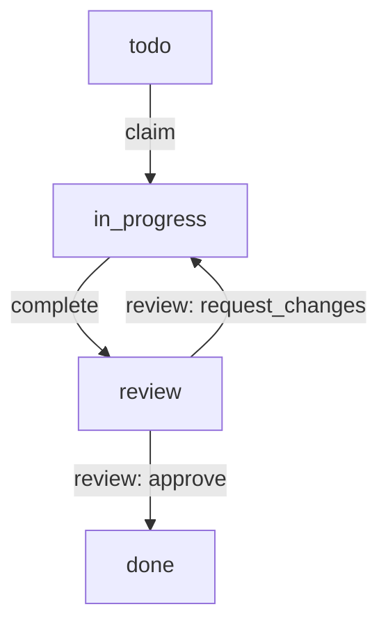

# Especificação do Núcleo ESAA (Event Sourced Agent Architecture)

**ID da Tarefa:** T-1000  
**Versão da Spec:** 0.1.0  
**Status:** Proposta  

---

## 1. Visão Geral
A **Event Sourced Agent Architecture (ESAA)** é um protocolo e arquitetura de governança determinística orientada a eventos para o desenvolvimento coordenado e execução de tarefas por agentes de inteligência artificial autônomos. 

Em vez de persistir o estado atual do projeto de forma mutável, o ESAA baseia-se em um **Event Store** (*Append-Only*) que registra cada transição de governança como um evento imutável. O estado consolidado (Read Model) é reprojetado de forma determinística a partir deste log de eventos.

---

## 2. Princípios Fundamentais

1. **Imutabilidade**: O histórico de eventos em `.roadmap/activity.jsonl` é estritamente append-only. Eventos anteriores não podem ser reescritos ou alterados.
2. **Determinismo**: Qualquer runner ou orquestrador processando o log de eventos deve chegar exatamente à mesma projeção do roadmap de tarefas e issues.
3. **Desacoplamento de Runner e Ator**:
   * **Runner**: Identifica a entidade técnica/física que executa o pipeline (ex: `antigravity`, `claude`, `grok`, `codex`).
   * **Ator**: Identifica o papel lógico assumido durante a execução (ex: `agent-spec`, `agent-impl`, `agent-qa`, `orchestrator`).
4. **Fechamento Seguro (*Fail-Closed*)**: Em caso de incoerência, colisão de hashes ou violação de restrições de escrita (*boundary violation*), o pipeline deve parar imediatamente para avaliação humana.

---

## 3. Ciclo de Vida da Tarefa

O fluxo canônico de transição de estado para qualquer tarefa segue a sequência rígida abaixo:

* **`todo`**: Estado inicial após criação pelo Orchestrator. Nenhuma modificação de código ou arquivos é permitida neste estágio.
* **`in_progress`**: Assumido por um agente após um evento de `claim`. O agente de implementação correspondente é associado à tarefa.
* **`review`**: Assumido após o agente de implementação emitir a ação `complete`, contendo os metadados de verificação e a listagem de arquivos modificados (`file_updates`).
* **`done`**: Estado terminal. A transição ocorre após o ator `agent-qa` aprovar a especificação/implementação da tarefa via ação `review` com decisão `approve`. Nenhuma tarefa em estado `done` pode ser modificada ou reaberta.

---

## 4. Estrutura Canônica de Eventos

Cada entrada no Event Store deve respeitar a especificação do esquema JSON. Atributos obrigatórios incluem:

* `event_id`: Identificador único (gerado de forma determinística a partir do payload).
* `event_seq`: Sequência numérica incremental do evento.
* `ts`: Carimbo de data/hora ISO-8601.
* `actor`: O papel que executou a ação (`agent-spec`, `agent-impl`, `agent-qa`, etc.).
* `runner`: Detalhes técnicos da execução (incluindo `runner_id` e `command_surface`).
* `action`: A ação executada (ex: `claim`, `complete`, `review`, `verify.ok`).
* `payload`: Detalhes específicos de cada ação (ex: `task_id`, `verification`, `decision`).

---

## 5. Políticas de Verificação (Verify Gate)

* A consistência do repositório deve ser verificada a cada passo de sincronização com o comando `esaa verify`.
* A integridade de hash de projeção (`projection_hash_sha256`) é recalculada de forma contínua para prevenir corrupção oculta do log de eventos.
